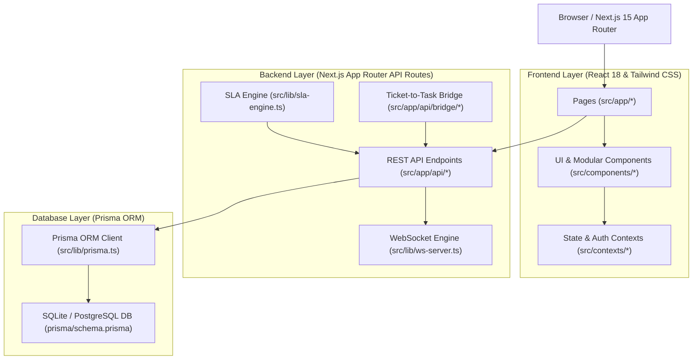

# Task & PMP Enterprise System — Comprehensive Architecture & File Structure

This document provides a complete, authoritative mapping of the **Task & PMP Enterprise System** application codebase. It maps every frontend route, UI page, React component, Next.js API endpoint, database schema model, context provider, and helper library.

---

## 🏗️ System Architecture Overview

The application follows a modern full-stack unified architecture combining **Help-Desk Ticketing** and **Project & Task Management**:

---

## 📁 Complete File-to-UI Page Structure Mapping

Below is the directory map linking every file to its exact UI page, component responsibilities, API endpoints, and database models.

| UI Page & Route | Primary Next.js File | Responsible React Components | API Routes & Handlers | Database Prisma Models | Purpose & Functionality |
| :--- | :--- | :--- | :--- | :--- | :--- |
| **Home Dashboard** `/dashboard` | [`src/app/dashboard/page.tsx`](file:///e:/Antigravity-clie/Task&PMP-System/src/app/dashboard/page.tsx) | AppLayout, KPI Cards, Doughnut Chart | `/api/dashboard` `/api/tickets` `/api/projects` | `Ticket`, `Task`, `Project`, `TimeLog`, `Activity` | Real-time executive dashboard with live metrics, priority breakdown charts, resolution rates, resource hours, and project progress. |
| **Projects List & Overview** `/projects` | [`src/app/projects/page.tsx`](file:///e:/Antigravity-clie/Task&PMP-System/src/app/projects/page.tsx) | Projects Table, TemplateGalleryModal, New Project Form | `/api/projects` `/api/projects/[id]` | `Project`, `User`, `Team`, `Milestone` | Projects list view with auto-sequential key generator (`DT-31`), dual local/server persistence, export, status tabs, and filtering. |
| **Project Details & Tasks** `/projects/[id]` | [`src/app/projects/[id]/page.tsx`](file:///e:/Antigravity-clie/Task&PMP-System/src/app/projects/[id]/page.tsx) | ListView, KanbanBoard, GanttChart, WBSView, TaskDetailDrawer | `/api/projects/[id]` `/api/tasks` `/api/task-lists` | `Project`, `Task`, `TaskList`, `Milestone`, `TaskDependency` | Hub for project execution across List, Kanban, Gantt (with Critical Path & Slack), and WBS views, with subtask reordering and import wizard. |
| **Tickets List & Help Desk** `/tickets` | [`src/app/tickets/page.tsx`](file:///e:/Antigravity-clie/Task&PMP-System/src/app/tickets/page.tsx) | Ticket Table, SLA Status Badges, Convert-to-Task Modal | `/api/tickets` `/api/tickets/[id]` | `Ticket`, `Customer`, `SlaPolicy`, `User` | Ticketing desk with SLA breach tracking, priority filtering, customer mapping, and ticket-to-task bridge triggers. |
| **Ticket Details & Discussion** `/tickets/[id]` | [`src/app/tickets/[id]/page.tsx`](file:///e:/Antigravity-clie/Task&PMP-System/src/app/tickets/[id]/page.tsx) | Ticket Detail Header, Comment Stream, Time Log Modal | `/api/tickets/[id]` `/api/tickets/[id]/comments` | `Ticket`, `TicketComment`, `TimeLog`, `KnowledgeBaseArticle` | SLA breakdown countdown, internal vs public comments, linked KB articles, and conversion to project tasks. |
| **Time Tracking & Logs** `/time-tracking` | [`src/app/time-tracking/page.tsx`](file:///e:/Antigravity-clie/Task&PMP-System/src/app/time-tracking/page.tsx) | Time Logs Table, Weekly Timesheet, Log Time Modal | `/api/time-logs` `/api/time-logs/[id]` | `TimeLog`, `Task`, `Ticket`, `Project`, `User` | Log billable vs non-billable hours, view weekly resource allocation, export timesheets, and track task durations. |
| **Knowledge Base** `/kb` | [`src/app/kb/page.tsx`](file:///e:/Antigravity-clie/Task&PMP-System/src/app/kb/page.tsx) | KB Article Grid, Tag Filter, Article Reader | `/api/kb` `/api/kb/[id]` | `KnowledgeBaseArticle`, `TicketKbArticle` | Self-service portal with step-by-step learning materials, feature guides, tagging system, and ticket linkage. |
| **Reports & Analytics** `/reports` | [`src/app/reports/page.tsx`](file:///e:/Antigravity-clie/Task&PMP-System/src/app/reports/page.tsx) | SLA Compliance Chart, Velocity Chart, Export Drawer | `/api/reports` | `Ticket`, `Task`, `Project`, `SlaPolicy` | Comprehensive reporting on SLA compliance rates, team velocity, budget variance, and overdue task analytics. |
| **Enterprise Portal Settings** `/settings` | [`src/app/settings/page.tsx`](file:///e:/Antigravity-clie/Task&PMP-System/src/app/settings/page.tsx) | Portal Profile Form, URL Manager, Email Template Builder, Layout Canvas | `/api/settings` `/api/sla` | `User`, `SlaPolicy`, `SlaEscalation`, `Team` | Enterprise portal setup, custom task layouts & fields palette, SLA policy manager, email templates, and web address slug editor. |
| **User Authentication** `/login`, `/register` | [`src/app/login/page.tsx`](file:///e:/Antigravity-clie/Task&PMP-System/src/app/login/page.tsx) `src/app/register/page.tsx` | Auth Form Cards, Password Toggle | `/api/auth/login` `/api/auth/register` | `User`, `Team` | JWT authentication with bcrypt password hashing, role assignment, and session cookies. |

---

## 🛠️ Modular Component Hierarchy (`src/components/`)

### 1. Project & Task Views (`src/components/projects/`)
- [`task-list-view.tsx`](file:///e:/Antigravity-clie/Task&PMP-System/src/components/projects/task-list-view.tsx): Task List view with custom views popover, context action menu, column customizer dual list, add column drawer, in-module automation drawer, visual flow builder, 6-level subtask drag-and-drop reordering (`::` handle + `☑ Drop here to reorder the task.` banner), and 4-step Import Tasks wizard modal (`MPP/MPX`).
- [`task-detail-drawer.tsx`](file:///e:/Antigravity-clie/Task&PMP-System/src/components/projects/task-detail-drawer.tsx): Task slide-out detail drawer with inline title/status editing, subtask list, time logging, followers, and comments.
- [`wbs-view.tsx`](file:///e:/Antigravity-clie/Task&PMP-System/src/components/projects/wbs-view.tsx): Work Breakdown Structure hierarchical tree.
- [`create-task-modal.tsx`](file:///e:/Antigravity-clie/Task&PMP-System/src/components/projects/create-task-modal.tsx): Modal for creating new tasks with layout field mapping.
- [`create-task-list-modal.tsx`](file:///e:/Antigravity-clie/Task&PMP-System/src/components/projects/create-task-list-modal.tsx): Drawer modal for creating new Task Lists under milestones.
- [`task-list-details-drawer.tsx`](file:///e:/Antigravity-clie/Task&PMP-System/src/components/projects/task-list-details-drawer.tsx): Custom Task List metadata drawer.
- [`edit-task-list-modal.tsx`](file:///e:/Antigravity-clie/Task&PMP-System/src/components/projects/edit-task-list-modal.tsx): Edit Task List title and sequence.
- [`move-task-list-modal.tsx`](file:///e:/Antigravity-clie/Task&PMP-System/src/components/projects/move-task-list-modal.tsx): Move Task List across projects or milestones.
- [`clone-task-list-modal.tsx`](file:///e:/Antigravity-clie/Task&PMP-System/src/components/projects/clone-task-list-modal.tsx): Duplicate Task List with tasks.
- [`milestone-details-drawer.tsx`](file:///e:/Antigravity-clie/Task&PMP-System/src/components/projects/milestone-details-drawer.tsx): Milestone detail drawer.
- [`project-dashboard-tab.tsx`](file:///e:/Antigravity-clie/Task&PMP-System/src/components/projects/project-dashboard-tab.tsx): Individual project performance metrics tab.
- [`project-phases-tab.tsx`](file:///e:/Antigravity-clie/Task&PMP-System/src/components/projects/project-phases-tab.tsx): Project phases & milestone timeline tab.
- [`project-documents-tab.tsx`](file:///e:/Antigravity-clie/Task&PMP-System/src/components/projects/project-documents-tab.tsx): File attachments and asset manager.
- [`project-issues-tab.tsx`](file:///e:/Antigravity-clie/Task&PMP-System/src/components/projects/project-issues-tab.tsx): Project-linked tickets and issues tab.
- [`project-forums-tab.tsx`](file:///e:/Antigravity-clie/Task&PMP-System/src/components/projects/project-forums-tab.tsx): Team discussions tab.
- [`project-users-tab.tsx`](file:///e:/Antigravity-clie/Task&PMP-System/src/components/projects/project-users-tab.tsx): Project team members and role permissions tab.
- [`project-reports-tab.tsx`](file:///e:/Antigravity-clie/Task&PMP-System/src/components/projects/project-reports-tab.tsx): Project analytics reports.

### 2. Interactive Charts (`src/components/gantt/` & `src/components/kanban/`)
- [`gantt-chart.tsx`](file:///e:/Antigravity-clie/Task&PMP-System/src/components/gantt/gantt-chart.tsx): Interactive Gantt chart with **Critical Path Engine** (red bars & critical link indicators), **Slack/Float Engine** (blue dotted slack extension lines `strokeDasharray="4 4"` with `Slack: Xd` labels), dependency types (`FS`, `SS`, `FF`, `SF`), and Smart Bar toggles (`Critical Path`, `Slack`).
- [`kanban-board.tsx`](file:///e:/Antigravity-clie/Task&PMP-System/src/components/kanban/kanban-board.tsx): Drag-and-drop Kanban board supporting `@hello-pangea/dnd` across status columns.

---

## ⚡ Real-Time Backend & Library Services (`src/lib/`)

- [`prisma.ts`](file:///e:/Antigravity-clie/Task&PMP-System/src/lib/prisma.ts): Prisma ORM singleton database connection client.
- [`auth.ts`](file:///e:/Antigravity-clie/Task&PMP-System/src/lib/auth.ts): JWT token signing (`signJwt`), verification (`verifyJwt`), and request session parser (`getSession`).
- [`sla-engine.ts`](file:///e:/Antigravity-clie/Task&PMP-System/src/lib/sla-engine.ts): Automatic SLA calculation engine running background timers for ticket breach detection and escalation triggers.
- [`websocket-server.ts`](file:///e:/Antigravity-clie/Task&PMP-System/src/lib/websocket-server.ts): Real-time WebSocket broadcasting server running on port 3001 for live task/ticket status updates.
- [`utils.ts`](file:///e:/Antigravity-clie/Task&PMP-System/src/lib/utils.ts): Helper utilities (`getAuthHeaders`, `generateProjectKey`, `getNextSequentialProjectKey`, `parseFlexibleDate`, SLA calculation).

---

## 🔄 Self-Maintaining Protocol for Future Features

Whenever adding new features or UI modules to the application:
1. **Schema Layer**: Define new Prisma models or fields in `prisma/schema.prisma` and run `npm run prisma:push`.
2. **API Layer**: Create RESTful API endpoints in `src/app/api/<feature>/route.ts`.
3. **Component Layer**: Place reusable React UI components in `src/components/<feature>/`.
4. **Page Layer**: Implement Next.js App Router pages under `src/app/<feature>/page.tsx`.
5. **Architecture Update**: Update this `ARCHITECTURE.md` document and `README.md` to keep the codebase transparent and fully documented.
